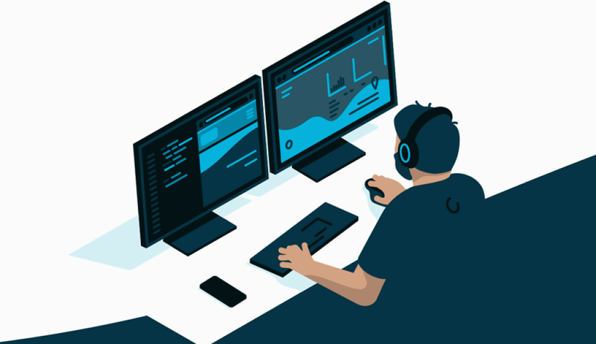
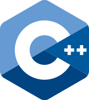
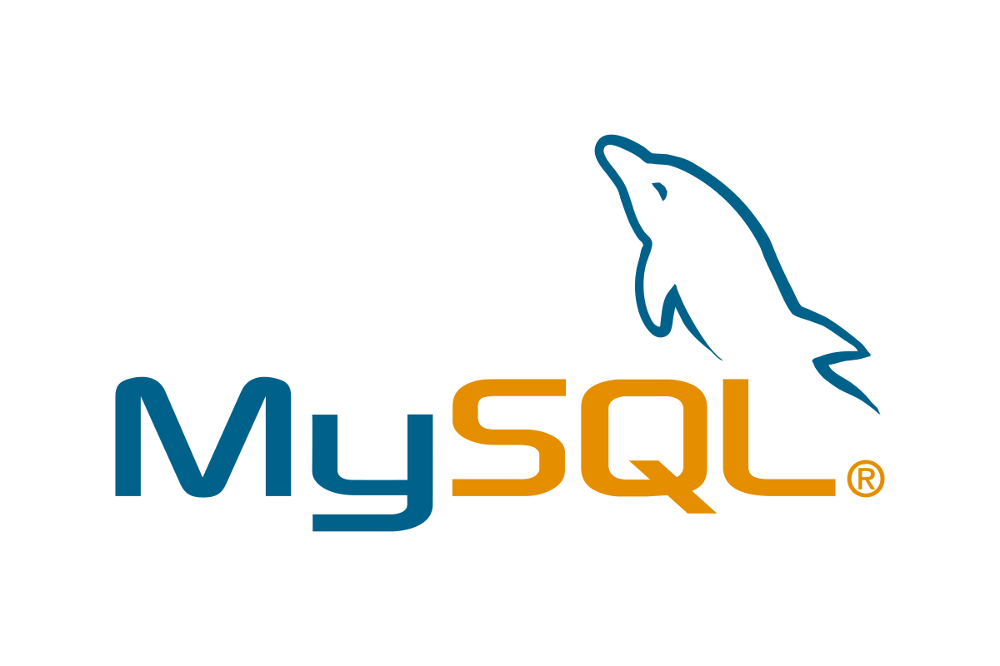
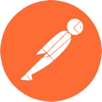

</img>
 

<h1>Hey,I'm Salman Adhikari</img></h1>
<b>I'm 18 Year Old Student From India Pursuing My IT B.E From SIES Graduation School Of Technology It's Always Fun For Me To Build And Explore New Things.I Like To Talk With Peoples.Like To Take Challenges blah blah...</b>
<h2>🖥About Me</h2>
- 🎯 I Wanted To Become a Software Engineer  
- 🧐 I Like To Solve The Real World Problems  
- 👨‍💻 I'm Learning New Things Rapidly  
- 🕵️‍♂️ I’m currently learning about Machine Learning 
- ☺ I Like Mathematics, Reading Articles&Blogs  
- 😇 I'm Intrested In Working In Startup   

<b>👨‍💻Programing Languages 

 
 

 

<b>🌍Web Development 

<b>DataBases 

    

  

<b>🛠Tools 

  
 

 
 

<b></img>Social 

    </a>
  
  

 
  

 &nbsp;<i><b>Git Activeness</b></i>

  

 
 
<i>Random dev joke for you!</i> 

  

